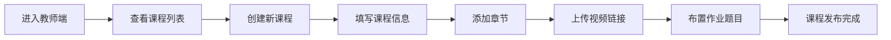
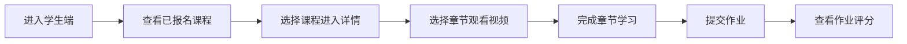

## 1. 产品概述

在线教育培训平台课程管理系统，面向教师和学生两种角色，提供课程创建、视频学习、作业布置与提交的完整教学流程。

- 主要目的：为在线教育场景提供轻量级的课程管理与学习界面
- 目标用户：教师（课程创作者）和学生（课程学习者）
- 产品价值：简化在线课程创建与学习流程，提升教学互动体验

## 2. 核心功能

### 2.1 用户角色

| 角色 | 登录方式 | 核心权限 |
|------|---------|----------|
| 教师 | 角色切换模拟 | 创建课程、管理章节视频、布置作业、查看作业评分 |
| 学生 | 角色切换模拟 | 浏览已报名课程、观看视频、提交作业、查看成绩 |

### 2.2 功能模块

1. **教师端 - 课程列表页**：课程卡片网格展示、创建课程入口、课程管理操作
2. **教师端 - 创建/编辑课程页**：课程基本信息编辑、章节管理、作业题目布置
3. **教师端 - 课程详情页**：章节目录树（可展开收起）、视频管理、作业管理
4. **学生端 - 课程列表页**：已报名课程卡片网格、学习进度展示
5. **学生端 - 课程详情页**：章节目录树、视频播放器、作业提交面板、作业评分查看

### 2.3 页面详情

| 页面名称 | 模块名称 | 功能描述 |
|---------|---------|---------|
| 教师课程列表页 | 课程卡片网格 | 展示所有教授的课程，支持创建新课程 |
| 教师课程详情页 | 章节目录树 | 可展开收起的章节列表，支持添加章节和视频 |
| 教师课程详情页 | 作业管理面板 | 布置作业题目，查看学生提交情况 |
| 学生课程列表页 | 课程卡片网格 | 展示已报名课程，显示学习进度百分比 |
| 学生课程详情页 | 视频播放器 | video 标签占位，支持章节切换 |
| 学生课程详情页 | 作业提交面板 | 提交作业文本，查看批改分数和评语 |

## 3. 核心流程

教师创建课程流程：

学生学习流程：

## 4. 用户界面设计

### 4.1 设计风格

- **主色调**：深海蓝 (#1e3a5f) 作为主色，搭配青绿色 (#10b981) 作为强调色
- **辅助色**：暖橙色 (#f59e0b) 用于进度和提醒
- **中性色**：以 slate 色系为基础，深灰背景 + 白色卡片
- **按钮风格**：圆角矩形，悬停时有微妙的阴影和缩放效果
- **字体**：使用 Inter 作为主要字体，现代简洁
- **布局风格**：卡片式布局，清晰的信息层级，充足留白
- **图标风格**：使用 Lucide 线性图标，统一风格

### 4.2 页面设计概览

| 页面名称 | 模块名称 | UI 元素 |
|---------|---------|---------|
| 课程列表页 | 课程卡片网格 | 卡片悬停上浮效果、封面图、进度条、元信息标签 |
| 课程详情页 | 章节目录树 | 可展开收起的树状结构、当前章节高亮、进度指示器 |
| 课程详情页 | 视频播放器区域 | 大尺寸 video 占位、章节标题、播放控制 |
| 课程详情页 | 作业面板 | 题目展示、文本输入框、提交按钮、分数展示 |

### 4.3 响应式设计

- 桌面端优先设计，自适应到平板和移动端
- 课程卡片网格：桌面 3 列、平板 2 列、移动端 1 列
- 课程详情页采用侧边栏 + 主内容区布局，移动端转为上下布局
- 触摸交互优化，确保点击区域足够大

### 4.4 动效与交互

- 页面加载时元素渐入动画
- 卡片悬停有微妙的上浮和阴影变化
- 章节展开/收起有平滑过渡动画
- 按钮和可点击元素有状态反馈
- 进度条变化有缓动效果
