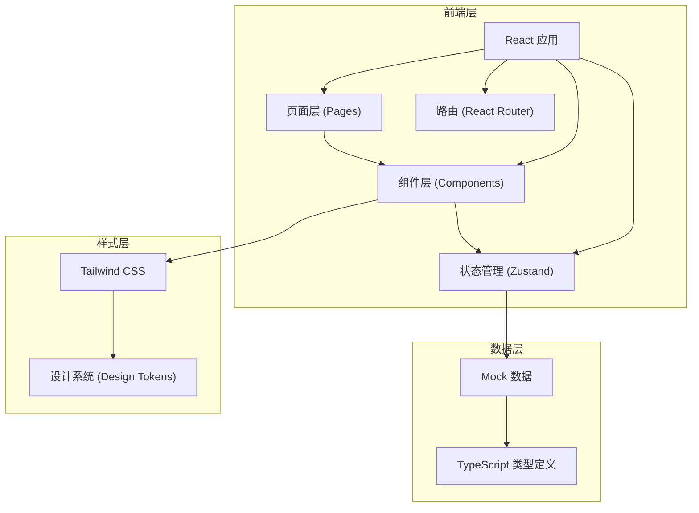
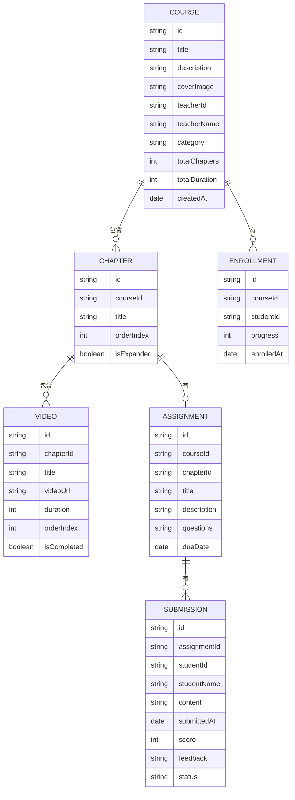

## 1. 架构设计



## 2. 技术描述

- **前端框架**：React 18 + TypeScript
- **构建工具**：Vite
- **路由管理**：react-router-dom v6
- **状态管理**：zustand
- **样式方案**：Tailwind CSS 3
- **图标库**：lucide-react
- **数据方案**：本地 Mock 数据，无后端
- **初始化工具**：vite-init

## 3. 路由定义

| 路由路径 | 页面说明 |
|---------|---------|
| `/` | 首页，角色选择 + 课程列表重定向 |
| `/teacher/courses` | 教师端 - 课程列表页 |
| `/teacher/courses/create` | 教师端 - 创建课程页 |
| `/teacher/courses/:id` | 教师端 - 课程详情管理页 |
| `/student/courses` | 学生端 - 已报名课程列表页 |
| `/student/courses/:id` | 学生端 - 课程学习详情页 |

## 4. 数据模型

### 4.1 数据模型定义



### 4.2 类型定义

```typescript
interface Course {
  id: string;
  title: string;
  description: string;
  coverImage: string;
  teacherId: string;
  teacherName: string;
  category: string;
  chapters: Chapter[];
  createdAt: string;
}

interface Chapter {
  id: string;
  title: string;
  orderIndex: number;
  videos: Video[];
  assignment?: Assignment;
  isExpanded?: boolean;
}

interface Video {
  id: string;
  title: string;
  videoUrl: string;
  duration: number;
  orderIndex: number;
  isCompleted?: boolean;
}

interface Assignment {
  id: string;
  title: string;
  description: string;
  questions: string[];
  dueDate: string;
}

interface Submission {
  id: string;
  assignmentId: string;
  studentId: string;
  studentName: string;
  content: string;
  submittedAt: string;
  score?: number;
  feedback?: string;
  status: 'pending' | 'submitted' | 'graded';
}

interface Enrollment {
  courseId: string;
  progress: number;
  completedVideos: string[];
  enrolledAt: string;
}

type UserRole = 'teacher' | 'student';
```

## 5. 项目结构

```
src/
├── components/          # 可复用组件
│   ├── CourseCard.tsx       # 课程卡片
│   ├── ChapterTree.tsx      # 章节目录树
│   ├── VideoPlayer.tsx      # 视频播放器
│   ├── AssignmentPanel.tsx  # 作业面板
│   ├── ProgressBar.tsx      # 进度条
│   ├── Navbar.tsx           # 导航栏
│   └── RoleSwitcher.tsx     # 角色切换
├── pages/               # 页面组件
│   ├── teacher/
│   │   ├── CourseList.tsx    # 教师课程列表
│   │   ├── CourseCreate.tsx  # 创建课程
│   │   └── CourseDetail.tsx  # 教师课程详情
│   └── student/
│       ├── CourseList.tsx    # 学生课程列表
│       └── CourseDetail.tsx  # 学生课程详情
├── store/               # 状态管理
│   └── useCourseStore.ts
├── data/                # Mock 数据
│   └── mockCourses.ts
├── types/               # TypeScript 类型
│   └── index.ts
├── App.tsx
├── main.tsx
└── index.css
```
